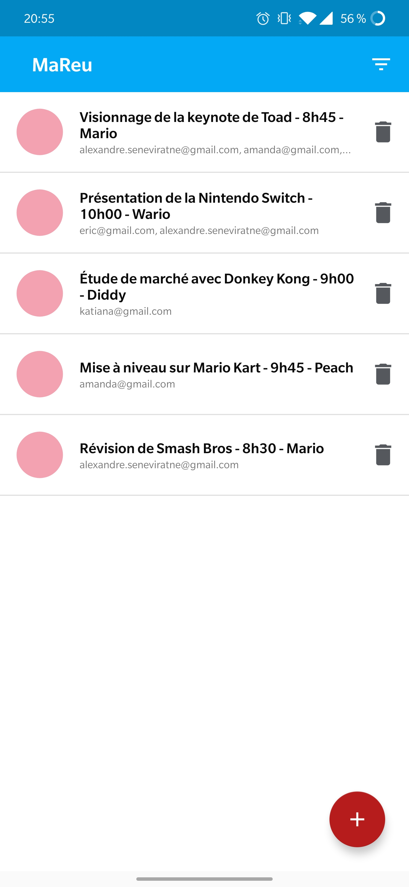
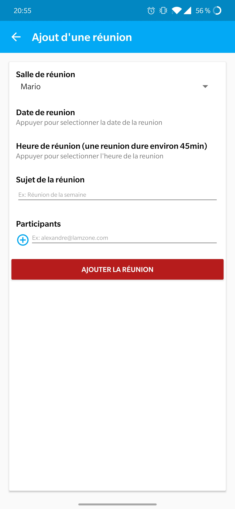
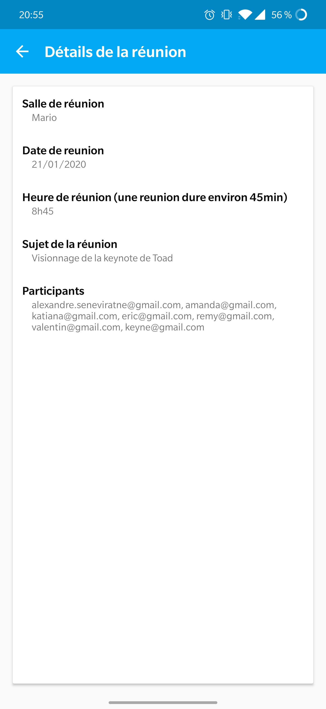
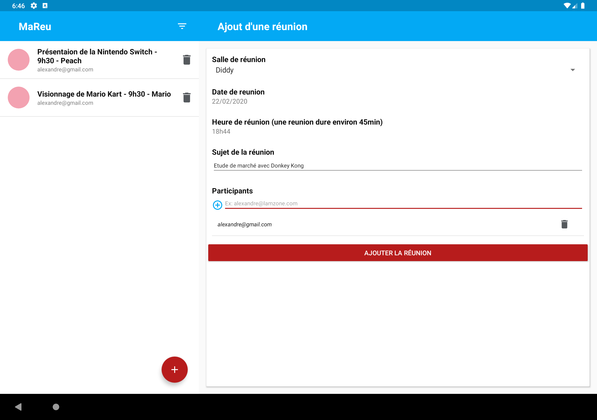
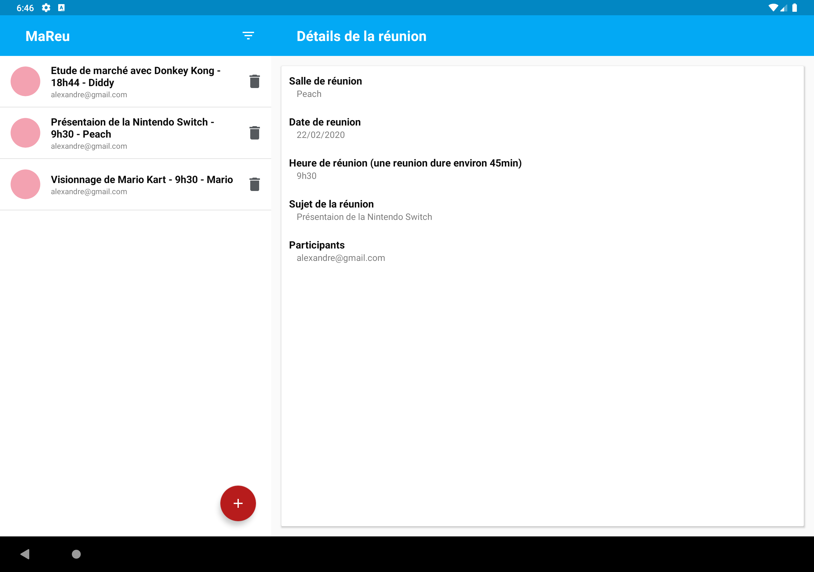

# MaReu

Ma Réu est l’application de gestion de réunions utilisée par tous les services de l’entreprise.

|  |  |  |
|:---:|:---:|:---:|

## Installation
Cloner ce repertoire et importer sur **Android Studio**
```bash
git clone git@github.com:Sango17/MaReu.git
```

## Fonctionnalités

### Ajout d'une réservation de réunion
* Sélection de la salle de réunion
* Sélection de la date de réunion
* Sélection de l'heure de début de la réunion
* Ajout du sujet de la réunion
* Ajout des participants de la réunion
* Suppression des participants de la réunion
* Avertissement lors d'un manque d'informations

### Visualisation de la liste des réservations de réunion
* Extrait du détail de réunion
* Suppression de réunion
* Filtre par "Salle"
* Filtre par "date"

### Visualisation des détails d'une réservation de réunion
* Affichage de la salle de réunion
* Affichage de la date de réunion
* Affichage de l'heure de début de la réunion
* Affichage sujet de la réunion
* Affichage des participants de la réunion

## Format tablette
|  |  |
|:---:|:---:|
